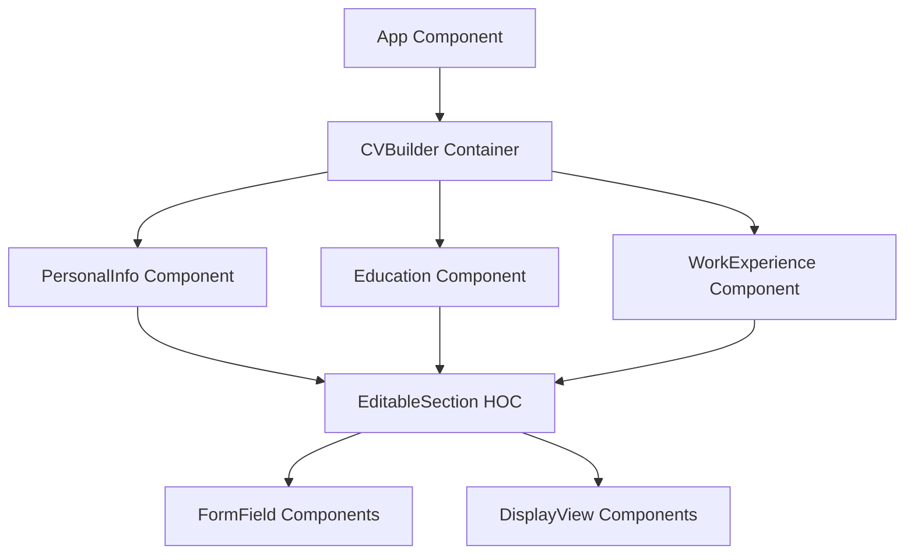

# Design Document

## Overview

The React CV Builder is a single-page application that allows users to create and edit their CV/resume through an intuitive interface. The application follows a component-based architecture with clear separation of concerns, utilizing React's state management for data handling and CSS modules for styling. The design emphasizes modularity, reusability, and responsive behavior across different screen sizes.

## Architecture

### High-Level Architecture



### Component Hierarchy

-   **App**: Root component that provides global styling and layout
-   **CVBuilder**: Main container component that manages overall CV state
-   **EditableSection**: Higher-order component that provides edit/display functionality
-   **PersonalInfo**: Manages personal information (name, email, phone)
-   **Education**: Manages educational background entries
-   **WorkExperience**: Manages work experience entries
-   **FormField**: Reusable input components (TextInput, TextArea, DateInput)
-   **DisplayView**: Reusable display components for showing formatted data

## Components and Interfaces

### Core Components

#### CVBuilder (Container Component)

```typescript
interface CVData {
    personalInfo: PersonalInfo;
    education: Education[];
    workExperience: WorkExperience[];
}

interface CVBuilderProps {}

interface CVBuilderState {
    cvData: CVData;
    editingSections: Set<string>;
}
```

**Responsibilities:**

-   Manages the overall CV data state
-   Coordinates between different sections
-   Handles data persistence (localStorage)
-   Provides callbacks for section updates

#### EditableSection (Higher-Order Component)

```typescript
interface EditableSectionProps {
    sectionId: string;
    data: any;
    onSave: (data: any) => void;
    onCancel: () => void;
    isEditing: boolean;
    children: (props: EditableSectionChildProps) => React.ReactNode;
}

interface EditableSectionChildProps {
    isEditing: boolean;
    data: any;
    onFieldChange: (field: string, value: any) => void;
    onSubmit: () => void;
    onEdit: () => void;
    onCancel: () => void;
}
```

**Responsibilities:**

-   Provides edit/display mode switching
-   Handles form validation
-   Manages local state during editing
-   Provides consistent edit/submit/cancel UI

#### PersonalInfo Component

```typescript
interface PersonalInfo {
    name: string;
    email: string;
    phone: string;
}

interface PersonalInfoProps {
    data: PersonalInfo;
    onUpdate: (data: PersonalInfo) => void;
}
```

**Responsibilities:**

-   Renders personal information form and display
-   Validates email format and phone number
-   Handles personal info state management

#### Education Component

```typescript
interface Education {
    id: string;
    schoolName: string;
    titleOfStudy: string;
    startDate: string;
    endDate: string;
}

interface EducationProps {
    data: Education[];
    onUpdate: (data: Education[]) => void;
}
```

**Responsibilities:**

-   Manages multiple education entries
-   Provides add/remove functionality for entries
-   Sorts entries chronologically
-   Validates date ranges

#### WorkExperience Component

```typescript
interface WorkExperience {
    id: string;
    companyName: string;
    positionTitle: string;
    responsibilities: string;
    startDate: string;
    endDate: string;
    isCurrent: boolean;
}

interface WorkExperienceProps {
    data: WorkExperience[];
    onUpdate: (data: WorkExperience[]) => void;
}
```

**Responsibilities:**

-   Manages multiple work experience entries
-   Handles current job indicator
-   Provides rich text input for responsibilities
-   Sorts entries by date (most recent first)

### Reusable Form Components

#### TextInput

```typescript
interface TextInputProps {
    label: string;
    value: string;
    onChange: (value: string) => void;
    placeholder?: string;
    required?: boolean;
    type?: "text" | "email" | "tel";
    error?: string;
}
```

#### TextArea

```typescript
interface TextAreaProps {
    label: string;
    value: string;
    onChange: (value: string) => void;
    placeholder?: string;
    required?: boolean;
    rows?: number;
    error?: string;
}
```

#### DateInput

```typescript
interface DateInputProps {
    label: string;
    value: string;
    onChange: (value: string) => void;
    required?: boolean;
    error?: string;
}
```

## Data Models

### State Management Strategy

The application uses React's built-in state management with the following approach:

1. **CVBuilder** maintains the master state for all CV data
2. **EditableSection** HOC manages temporary editing state
3. **localStorage** provides data persistence between sessions
4. State updates flow unidirectionally from parent to child components

### Data Validation

```typescript
interface ValidationRule {
    field: string;
    validator: (value: any) => string | null;
    required?: boolean;
}

const personalInfoValidation: ValidationRule[] = [
    {
        field: "name",
        validator: (value: string) =>
            value.trim().length < 2
                ? "Name must be at least 2 characters"
                : null,
        required: true,
    },
    {
        field: "email",
        validator: (value: string) => {
            const emailRegex = /^[^\s@]+@[^\s@]+\.[^\s@]+$/;
            return !emailRegex.test(value)
                ? "Please enter a valid email address"
                : null;
        },
        required: true,
    },
    {
        field: "phone",
        validator: (value: string) => {
            const phoneRegex = /^[\+]?[1-9][\d]{0,15}$/;
            return !phoneRegex.test(value.replace(/[\s\-\(\)]/g, ""))
                ? "Please enter a valid phone number"
                : null;
        },
        required: true,
    },
];
```

## Error Handling

### Validation Error Handling

1. **Field-level validation**: Real-time validation as user types
2. **Form-level validation**: Comprehensive validation on submit
3. **Error display**: Inline error messages below each field
4. **Error prevention**: Disable submit button when validation fails

### Data Persistence Error Handling

1. **localStorage failures**: Graceful degradation with in-memory storage
2. **JSON parsing errors**: Reset to default state with user notification
3. **Browser compatibility**: Feature detection for localStorage support

### User Experience Error Handling

1. **Network issues**: Offline-first design with local storage
2. **Browser crashes**: Auto-save functionality every 30 seconds
3. **Accidental navigation**: Warn user about unsaved changes

## Testing Strategy

### Unit Testing

1. **Component Testing**: Test each component in isolation using React Testing Library
2. **Hook Testing**: Test custom hooks with @testing-library/react-hooks
3. **Utility Testing**: Test validation functions and data transformations
4. **Snapshot Testing**: Ensure UI consistency across changes

### Integration Testing

1. **User Flow Testing**: Test complete user journeys (add info → edit → save)
2. **State Management Testing**: Test data flow between components
3. **Form Validation Testing**: Test validation rules and error handling
4. **Responsive Testing**: Test layout behavior across screen sizes

### E2E Testing

1. **Critical Path Testing**: Test main user workflows end-to-end
2. **Cross-browser Testing**: Ensure compatibility across major browsers
3. **Accessibility Testing**: Test keyboard navigation and screen reader support
4. **Performance Testing**: Test loading times and responsiveness

### Testing Tools

-   **Jest**: Unit and integration testing framework
-   **React Testing Library**: Component testing utilities
-   **MSW (Mock Service Worker)**: API mocking for tests
-   **Cypress**: End-to-end testing framework

## Responsive Design Strategy

### Breakpoint System

```css
/* Mobile First Approach */
:root {
    --mobile: 320px;
    --tablet: 768px;
    --desktop: 1024px;
    --large-desktop: 1440px;
}

@media (min-width: 768px) {
    /* Tablet */
}
@media (min-width: 1024px) {
    /* Desktop */
}
@media (min-width: 1440px) {
    /* Large Desktop */
}
```

### Layout Strategy

1. **Mobile (320px - 767px)**:

    - Single column layout
    - Stacked sections
    - Full-width form fields
    - Touch-friendly button sizes (44px minimum)

2. **Tablet (768px - 1023px)**:

    - Two-column layout for forms
    - Side-by-side edit/display views
    - Optimized for touch interaction

3. **Desktop (1024px+)**:
    - Multi-column layout matching the provided example
    - Left sidebar for form inputs
    - Right main area for CV display
    - Hover states for interactive elements

### CSS Architecture

```
src/
├── styles/
│   ├── globals.css          # Global styles and CSS variables
│   ├── components/
│   │   ├── CVBuilder.module.css
│   │   ├── PersonalInfo.module.css
│   │   ├── Education.module.css
│   │   ├── WorkExperience.module.css
│   │   └── EditableSection.module.css
│   ├── shared/
│   │   ├── FormField.module.css
│   │   ├── Button.module.css
│   │   └── Layout.module.css
│   └── utils/
│       ├── breakpoints.css
│       └── mixins.css
```

## Performance Considerations

### Optimization Strategies

1. **Code Splitting**: Lazy load components that aren't immediately needed
2. **Memoization**: Use React.memo for components that don't change frequently
3. **Virtual Scrolling**: For large lists of education/experience entries
4. **Debounced Validation**: Prevent excessive validation calls during typing

### Bundle Optimization

1. **Tree Shaking**: Remove unused code from final bundle
2. **CSS Purging**: Remove unused CSS classes
3. **Image Optimization**: Compress and serve appropriate image formats
4. **Caching Strategy**: Implement proper browser caching headers

## Accessibility

### WCAG 2.1 Compliance

1. **Keyboard Navigation**: All interactive elements accessible via keyboard
2. **Screen Reader Support**: Proper ARIA labels and semantic HTML
3. **Color Contrast**: Minimum 4.5:1 contrast ratio for text
4. **Focus Management**: Clear focus indicators and logical tab order

### Implementation Details

1. **Form Labels**: Associate all form inputs with descriptive labels
2. **Error Announcements**: Use aria-live regions for validation errors
3. **Skip Links**: Provide navigation shortcuts for keyboard users
4. **Semantic HTML**: Use appropriate HTML elements for content structure
